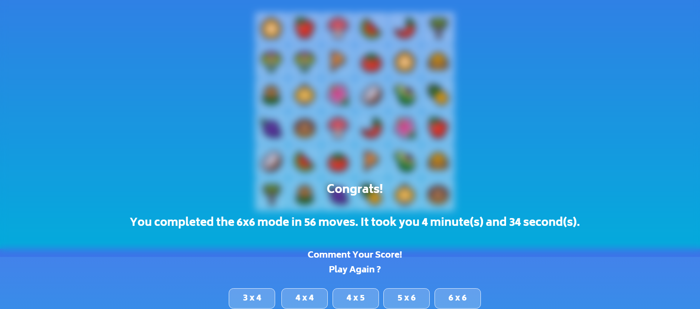

# 🧠 Memory Matching Game

A fun, responsive memory game built using HTML, CSS, and JavaScript with multiple difficulty levels.

[](https://vectorstatic.github.io/Memory-Matching-Game/)

---

## 🎮 Game Features
- Multiple difficulty levels: 3x4, 4x4, 4x5, 5x6, 6x6
- Colorful emoji-based cards
- Timer & move counter
- Flip animations
- Responsive design
- Glassmorphism UI style

---

## 🛠️ Tech Stack
- HTML5
- CSS3 (with gradients and blur effects)
- JavaScript (vanilla + jQuery)

---

## 🖼️ Snapshots

<p align="center">
  
  
  
  
</p>

---

## 🚀 Getting Started Locally

### Steps:
```bash
# Download and unzip the project
# Open index.html in your browser
```

No installation needed — it's a static HTML/JS/CSS project.

---

## 👨‍💻 Author
**Abinas Swain**  
📧 abinasswain400326@gmail.com

---

## 📄 License
This project is open-sourced under the [ISC License](https://opensource.org/licenses/ISC).

---

## 🌟 Future Enhancements
- Add sound effects
- Track high scores
- Add player profiles
- Dark mode toggle
- Mobile PWA support
